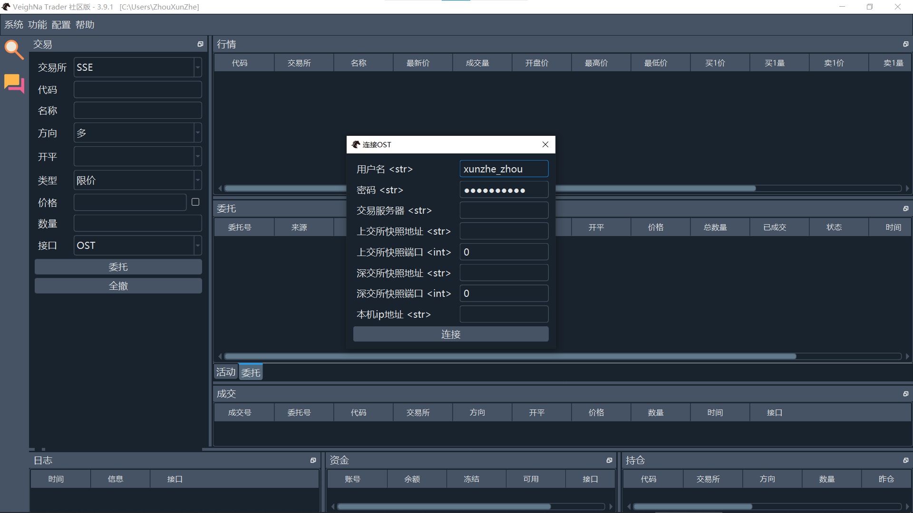

# VNPY

- 安装和使用vnpy进展到什么阶段，有什么问题？

  在安装时没有遇到问题，根据网上教程安装即可，只是不知道安装什么版本（普通版和elite版），最终选择普通版。在使用时根据b站教程（原先的教程已被删除），无法接入simnow数据。目前阶段为展示跳过vnpy框架，使用`yfinance`库调取道琼斯股指数据。

  

- 选一个vnpy的模块，找到模块在程序中的位置，给出文件列表，并对主要文件用大模型解读

  [vnpy_ctp/vnpy_ctp/gateway/ctp_gateway.py](https://github.com/vnpy/vnpy_ctp/blob/main/vnpy_ctp/gateway/ctp_gateway.py)

  这段代码实现了一个用于对接期货CTP柜台的交易接口，主要功能包括：

  1. **导入模块**：导入了一些必要的模块和包，比如`sys`, `datetime`, `sleep`, `pathlib`等，以及vn.py库中的一些类和常量。

  2. **映射字典**：定义了一些映射字典，用于将vn.py的常量和CTP的常量相互转换。例如：
     - `STATUS_CTP2VT`: 将CTP的委托状态转换为vn.py的状态。
     - `DIRECTION_VT2CTP` 和 `DIRECTION_CTP2VT`: 将方向从vn.py转换为CTP格式，反之亦然。
     - `ORDERTYPE_VT2CTP` 和 `ORDERTYPE_CTP2VT`: 将订单类型从vn.py转换为CTP格式，反之亦然。
     - 其他映射包括开平方向、交易所、产品类型和期权类型等。

  3. **常量定义**：定义了一些常量，如浮点数极限值和中国时区。

  4. **全局缓存字典**：定义了一个全局缓存字典`symbol_contract_map`，用于缓存合约数据。

  5. **CtpGateway类**：这是一个用于对接期货CTP柜台的交易接口的类，继承自`BaseGateway`。这个类中包含了连接交易接口、订阅行情、委托下单、委托撤单、查询资金和查询持仓等方法。

  6. **CtpMdApi类**：这个类继承自`MdApi`，用于处理行情数据的接口。包括连接行情服务器、登录、订阅行情、接收行情数据等功能。

  7. **CtpTdApi类**：这个类继承自`TdApi`，用于处理交易数据的接口。包括连接交易服务器、授权、登录、委托下单、委托撤单、查询资金和持仓等功能。

  8. **辅助函数**：定义了一个辅助函数`adjust_price`，用于将异常的浮点数最大值（`MAX_FLOAT`）调整为0。

  这段代码的主要目的是实现一个对接期货CTP柜台的交易接口，使得可以通过vn.py库进行期货交易和行情数据的接收与处理。

- 对这个模块主要程序的一段进行解释，说明用了python语言的那部分。

  ```python
  def __init__(self, event_engine: EventEngine, gateway_name: str) -> None:
          """构造函数"""
          super().__init__(event_engine, gateway_name)
  
          self.td_api: "CtpTdApi" = CtpTdApi(self)
          self.md_api: "CtpMdApi" = CtpMdApi(self)
  ```

  这段代码运用了Python编程语言的以下内容：

  1. **类的构造函数（`__init__` 方法）**：
     - `__init__` 是类的构造函数，用于在类实例化时初始化对象的属性。这里的构造函数接受两个参数 `event_engine` 和 `gateway_name`。
  2. **类型注解（Type Annotations）**：
     - `event_engine: EventEngine` 和 `gateway_name: str` 是参数的类型注解，用于指定参数的预期类型。`-> None` 指明该方法不返回任何值。
  3. **调用父类的构造函数**：
     - `super().__init__(event_engine, gateway_name)` 调用父类的构造函数，确保父类中的初始化代码也会被执行。这是面向对象编程中的一个常见操作，用于继承和扩展父类的功能。
  4. **实例变量（Instance Variables）**：
     - `self.td_api` 和 `self.md_api` 是类的实例变量，用于存储对象的状态。这些变量在类的其他方法中可以被访问和修改。
     - `self.td_api: "CtpTdApi"` 和 `self.md_api: "CtpMdApi"` 使用类型注解明确指出这些实例变量的类型。
  5. **创建类的实例**：
     - `self.td_api = CtpTdApi(self)` 和 `self.md_api = CtpMdApi(self)` 是在构造函数中创建 `CtpTdApi` 和 `CtpMdApi` 类的实例，并将它们赋值给实例变量 `self.td_api` 和 `self.md_api`。这些实例会在当前类的其他方法中使用。
  6. **字符串注释（String Annotations）**：
     - `self.td_api: "CtpTdApi"` 和 `self.md_api: "CtpMdApi"` 使用字符串注释来指定变量的类型。这在Python 3.5及更高版本中是合法的，在类内部定义变量类型时特别有用。

  这段代码展示了面向对象编程的核心概念，包括类的定义、构造函数、类型注解、继承和实例变量的使用。

