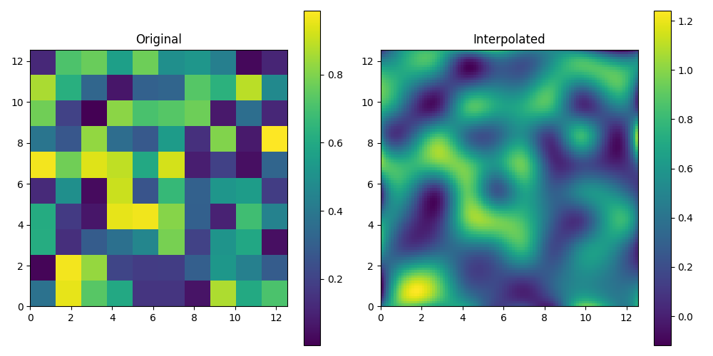

# hw8

本次作业中实现了

1. 调用`psutil`获取计算机内存，并计算所能存储的一维、二维、三维浮点矩阵大小

   得到结果：

   - 总内存大小: 15.36431884765625 GB
   - 最大一维矩阵长度: 2062163968
   - 最大二维矩阵行数和列数: 45411
   - 最大三维矩阵维度: 1272

2. 自行实现newton迭代法计算，并且调用`scipy.optimize`中的`newton`和`fsolve`函数验证`x+cos(x)=0`的解：

   - my newton Solution: -0.7390851332151607
   - scipy.newton Solution: -0.7390851332151607
   - scipy.fsolve Solution: -0.7390851332151607

3. 调用`scipy.interpolate`中的`RectBivariateSpline`插值方法实现二维噪声网格图像的插值和可视化：

